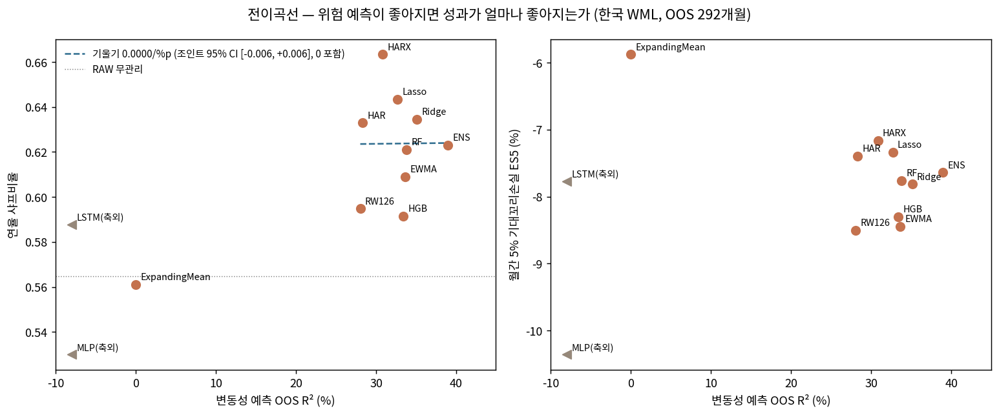

<div align="center">

# 위험 예측이 좋아지면 무엇이 좋아지는가

### 약한 모멘텀 시장에서 머신러닝 변동성 예측과 꼬리 보험

*What Improves When Risk Forecasts Improve:*
*Machine-Learned Volatility and Tail Insurance in a Weak Momentum Market*

[](LICENSE)
[](requirements.txt)
[](docs/05_results_ledger.md)
[](docs/06_claims_map.md)
[](output/tables/)
[](tests/verify_headline_numbers.py)

**[🧭 연구 여정 — 성공·실패·철회 전체 기록](https://soccz.github.io/projects/momentum-journey/)** ·
**[🎛️ 원논문(BS15) 재현 인터랙티브 데모](https://soccz.github.io/projects/momentum-barroso/)** ·
**[🇬🇧 English](README.en.md)**

</div>

---

> **이 저장소는 무엇인가** — 한국 주식 데이터로 쓴 학위논문의 **코드·정본 수치·실패 기록 전체**를 공개하는 동반 저장소다.
> 처음이라면: *모멘텀* = 최근 1년 오른 주식을 사고 내린 주식을 파는 전략, *꼬리 보험* = 가끔 오는 대폭락 달의 손실을 줄여주는 것.
> 배경지식 없이 읽으려면 [과정 한장요약](docs/03_process_onepager.md)과 [연구 여정 페이지](https://soccz.github.io/projects/momentum-journey/)의 "3분 요약·용어 16개"부터.

Barroso and Santa-Clara (2015, *JFE*)의 위험관리 모멘텀은 입력이 하나뿐인 규칙이다 — **위험 예측치**.
이 연구는 그 예측치를 단순 롤링 분산에서 HAR, 규제회귀, 트리 앙상블, 신경망까지
**사전 지정된 12개 모형으로 교체**하며, 예측이 좋아질 때 포트폴리오의 무엇이 좋아지는지를
한국 전종목 35년(1991–2026, 상장폐지 1,842종목 포함)에서 측정했다.

<div align="center">

<br><sub><b>전이곡선.</b> 예측이 좋아져도 샤프(좌)는 움직이지 않는다. 개선은 꼬리(우)로 간다 — 벤치마크 대비 쌍별로.</sub>
</div>

## 세 발견

| # | 발견 | 핵심 수치 |
|---|---|---|
| 1 | **예측은 좋아지지만 샤프는 따라오지 않는다** — 전이곡선의 샤프–정확도 기울기는 0과 구분되지 않는다 | QLIKE −24%, CW t=3.4인데 기울기 조인트 CI [−0.006, +0.006] |
| 2 | **개선은 꼬리로 간다** — 사전 지정 예측기에서 다중검정 보정을 통과하고, 극값이론으로 1% 꼬리까지, 순비용에서도 남는다 | ΔES5 +0.86%p · Romano–Wolf 통과(HAR·Lasso 0.040) · ES1% +4.9%p |
| 3 | **보험이 성립하는 곳은 좁고, 파는 것은 정확도가 아니라 구조다** — 약한 팩터 × 극단 구성의 교집합에서만; 증분의 대부분은 장기기억(HAR)·시장상태가 확보, 순수 ML 결합의 추가분은 0 | 한국−미국 차이 검정 D=+2.01%p (p=0.001) · ENS−HAR −0.25%p (비유의) |

국제 대조(미국 극단 10분위·미국 소형주·일본·유럽·북미·아태 2×3·한국 2×3 절제)는 전부 미재현 —
**예측은 전 시장에서 개선되는데(QLIKE 10~34%) 꼬리가 응답하는 곳은 한국 극단 구성뿐**이다.
이 미재현이 명제의 대우 검증이고, 논문의 경계조건 절이 됐다.

## 이 저장소가 특별한 이유: 과정 전체가 기록돼 있다

실패를 기록하는 이유는 하나다 — 심사장에서 나올 공격을 미리 맞아본 흉터가 논문의 방어력이기 때문이다. 39번의 실험(E00~E38) 중 성공만 남긴 게 아니다. **[결과 원장](docs/05_results_ledger.md)** 은 append-only로
실패·철회·정정을 전부 보존한다:

| 죽은 것 | 사인(死因) | 남긴 것 |
|---|---|---|
| 신경망 (MLP·LSTM) | 292개월 소표본 과적합, R² −73% / −439% | "실패도 사전 지정대로 보고" |
| "죽은 팩터 소생" 프레임 | 표본외 무관리도 t=2.79로 생존 | "약한 팩터의 꼬리 보험" — 최종 제목 |
| family-wise p=0.002 | max-t의 주인이 예측력 0짜리 디레버리지 | 유리하지만 틀린 숫자의 폐기 |
| ENS의 FWER 생존 | 보정 p=0.125 — 1차 대상 자신이 탈락 | "실패 먼저 보고"의 위계 (§4.4) |
| "약한 팩터 법칙" | 6개 시장 횡단면 기각, 최약 일본이 최악 | 경계조건 §8.4 |
| "머신러닝의 가치"라는 주장 단위 | ENS−HAR −0.25%p — 순수 ML 꼬리 이득 0 | "보험을 파는 것은 구조" |

<sup>전체 16건과 그 맥락은 [연구 여정 페이지 · 실패의 전당](https://soccz.github.io/projects/momentum-journey/#graveyard) 참조.</sup>

원고는 5개 렌즈(산문·저널심사·수치 전수대조·구조·학위방어)의 **블라인드 게이트 × 적대적 검증 7라운드**(서로를 볼 수 없는 5개 관점의 AI 심사 + 지적마다 별도 검증자가 반박 시도)로 닫았다.
확정된 지적은 표현 수정이 아니라 **계산**으로만 닫는 것이 규칙 — 마감 라운드에만 신규 검정 6본(p25~p30)이 추가됐고,
최종 라운드 판정은 확정 결함 0건·수치 전수대조 불일치 0건.

## 저장소 구조

```
code/                          분석 파이프라인 (번호 = 실행·논문 반영 순서)
├─ build_*.py                  팩터·ML 데이터셋·표·그림 빌드
├─ p2_forecast_race.py         예측 경기 (12개 예측기 리더보드)
├─ p3_transfer_curve.py        전이곡선 (킬러 피겨)
├─ p4_mechanism.py             성분 분해·교차팩터 플라시보·위기 타이밍
├─ p5~p9                       강건성 배터리 (부트스트랩·비용·구성 그리드·EVT 전 단계)
├─ p10~p17                     심사 대응 (RF 실질화·상폐/필터·EVT·Romano–Wolf·CRRA)
├─ p18~p24 · us/ · intl/       국제 병렬 (미국·4지역·2×3 절제·메커니즘 대리검정)
├─ p25~p30                     최종 게이트 신규 검정 (플라시보 꼬리·CW-SPA·표본창 분해·
│                              미국 동창·ML−HAR 분해·국제 QLIKE·한국−미국 차이 검정)
└─ build_pdf·inject·render_*   빌드·웹 배포 도구 (분석 아님)
docs/
├─ 00_paper_deep_dive.md       BS15 원논문 완전 해설 (수식·수치·약점·활용점)
├─ 01_reproduction_spec.md     방법론 고정 사양 (재논의 금지 항목과 근거)
├─ 02_mastery_test.md          원논문 자가시험지 (수치 암송·수식 유도·약점 방어)
├─ 03_process_onepager.md      무배경자용 과정 한장요약 (발표 도입부)
├─ 04_research_design.md       연구 설계 · 정직성 프로토콜
├─ 05_results_ledger.md        ★ 결과 원장 E00~E38 — 실패·철회 포함 전체 기록 (append-only)
├─ 06_claims_map.md            ★ 주장–근거 지도 C1~C48 — 주장↔수치↔표↔실험↔재현 명령
└─ figs/                       논문 그림 원본 4장
notebooks/momentum_korea.ipynb  교육용 최단순 재현 — pandas 기본기만, 수식↔코드 1:1 주석
reproduce/                      초간단 재현 킷 — SHA256 매니페스트 + FRED 라이브 대조 + 표 1·3 재현 (7게이트)
output/tables/  (71 CSV)        논문 모든 표의 정본 — 본문 수치는 전부 여기로 소급
output/figures/                 논문 그림
data/us/ · data/intl/           Ken French 공개 원자료(10분위·25포트·지역 팩터·F-F) + 파생 시계열 — 국제 병렬 완전 재현
data/processed/                 팩터 수준 파생 시계열 (WML·팩터·ML 피처·예측치 — 종목 수준 아님) + 무위험수익률
tests/verify_headline_numbers.py  ★ 헤드라인 수치 게이트 11건 (누구나 1초 재실행 가능)
```

## 빠른 시작

클론 직후 **그대로 실행되는 것부터** 순서대로:

```bash
pip install -r requirements.txt

# ① 헤드라인 게이트 — 핵심 주장 11건이 정본 CSV에서 재현되는지 (레포만으로 즉시 동작)
python tests/verify_headline_numbers.py

# ② 데이터 무결성 — SHA256 + FRED 라이브 대조 (레포만으로 동작, FnGuide 파일은 자동 건너뜀)
python reproduce/step0_check_data.py

# ③ 국제·미국 파이프라인 — KF 공개 원자료 포함 + 레포 상대경로라 그대로 재현됨
python code/us/p18_us_wml.py                 # BS15 미국 재현 게이트
python code/p29_intl_forecast_quality.py     # 국제 6계열 ΔES5·p 정확 재현 게이트
python code/p30_kr_us_difference.py          # 한국−미국 차이 검정 (FF 라이브 취득)

# ④ 한국 본편 파이프라인(p2~p27) — 각 스크립트 상단 ROOT 한 줄을 클론 경로로 수정 후 실행
#    ※ 재실행 산출물이 output/tables/ 정본을 덮어쓸 수 있으니 사본 디렉토리에서 권장
# ⑤ 원시 주가 → 표 1·3 재현(reproduce/step1)은 FnGuide 구독 데이터 필요 (아래 데이터 정책)
```

확률적 요소가 있는 스크립트는 전부 seed=42 고정이며, 완료 시 자체 검증 게이트(정본 CSV 재현 여부)를 출력한다.
국제·미국 계열(`code/us/`·`code/intl/`·`p24`·`p29`)은 레포 상대경로로 정규화되어 그대로 돈다 — 위 ③은 실제 실행으로 확인됨.
**종목 수준 원시 데이터가 필요한 것은 `build_*.py`(팩터 구축)와 `reproduce/step1`뿐**이다.

## 데이터 정책

| 데이터 | 출처 | 이 저장소 | 비고 |
|---|---|---|---|
| 한국 주가·시가총액·PBR (종목 수준) | FnGuide DataGuide (구독) | ❌ 미포함 | 라이선스상 재배포 불가 — [`reproduce/DATA_MANIFEST.txt`](reproduce/DATA_MANIFEST.txt)의 SHA256으로 동일성 검증 |
| 팩터 수준 파생 시계열 (WML·SMB·HML·피처·예측치) | 위 데이터의 집계 변형치 | ✅ 포함 | 종목 수준 아님 — KF가 CRSP 파생 팩터를 공개하는 것과 같은 관행 ([상세](data/README.md)) |
| 무위험수익률 (콜금리) | 한국은행 / FRED | ✅ 포함 | `step0`이 FRED에서 라이브 재다운로드해 대조 |
| 미국·국제 모멘텀/팩터 | Kenneth R. French Data Library | ✅ 포함 | 공개 데이터 — 국제 병렬 전체가 이 저장소만으로 재현됨 |
| 논문 전문 (한국어 v4.2) | — | ⏳ 심사 후 공개 | 그 전까지 모든 정량 주장은 [주장지도](docs/06_claims_map.md)와 [정본 CSV](output/tables/)로 검증 가능 |

그 외 비공개(사유): 심사 방어킷·투고 전략 내부 문서(docs/07·08·09 — 심사 전략), 전이계수 후속 프로젝트(별도 연구). 원장·주장지도가 이들을 참조하는 부분은 원 연구 레포 기준이다.

## 정직성 프로토콜

> "정직하게 쓰자"는 다짐은 마감 앞에서 무너진다. 그래서 다짐 대신 구조를 만들었다.

1. **사전 지정** — 예측기 12개·평가 프로토콜을 결과 산출 전 커밋으로 고정. 국제 절제 실험은 판정기준까지 실행 전 커밋.
2. **결과 원장 (append-only)** — 원장에 없으면 미완료. 틀린 진단도 덮어쓰지 않고 "E27-정정"처럼 정정 이력으로 보존. 원장 속 커밋 해시는 원 연구 레포 기준 — 공개판의 수치 검증은 `output/tables/` 정본 CSV와 `tests/` 게이트가 대신한다.
3. **주장–근거 지도** — 논문·발표의 모든 주장은 재현 명령이 달린 행 하나를 가진다. 근거 없는 주장은 물리적으로 쓸 수 없다.
4. **사후 개입 공개** — 결과 관찰 후 도입한 수치 안정화 장치 2건의 도입 계기·코드 위치를 논문 부록에 표로 공개.
5. **블라인드 게이트** — 실행자가 자기 산출물을 승인하지 않는다. 신선한 컨텍스트의 5렌즈 × 적대적 검증 × 7라운드.
6. **계산으로 닫기** — "검정이 없다"는 지적에는 검정을 만들어 답한다 (p25~p30이 그 기록).

## 인용

```bibtex
@misc{soccz2026momentum,
  title  = {Momentum Tail Insurance: What Improves When Risk Forecasts Improve},
  author = {soccz},
  year   = {2026},
  url    = {https://github.com/soccz/momentum-tail-insurance},
  note   = {Working paper; full text to be released after thesis defense}
}
```

원논문: Barroso, P., and P. Santa-Clara (2015), *Momentum has its moments*, Journal of Financial Economics 116(1), 111–120.
한국 BS15 재현 선행: 손경우·윤병욱·윤보현 (2017), 금융지식연구 15(1).

## License

코드는 [MIT](LICENSE). Ken French Data Library 파생 데이터의 권리는 원 출처에 있으며,
결과 표·그림은 학술 인용과 함께 자유롭게 사용 가능.
