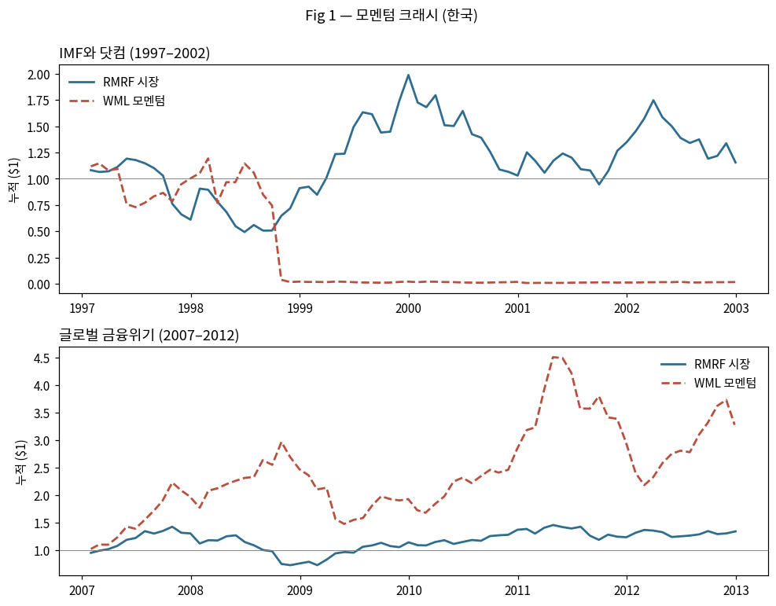
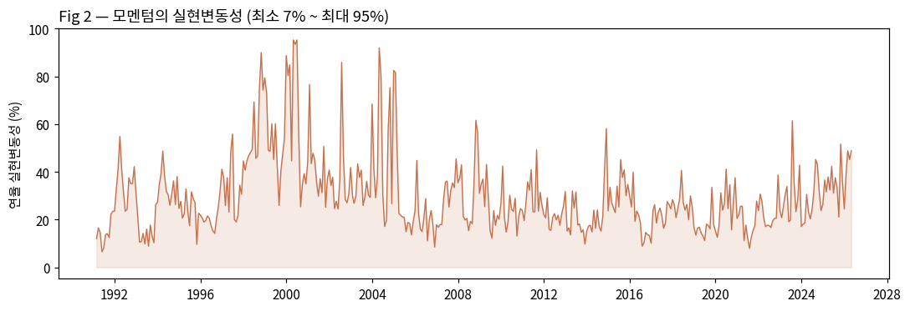
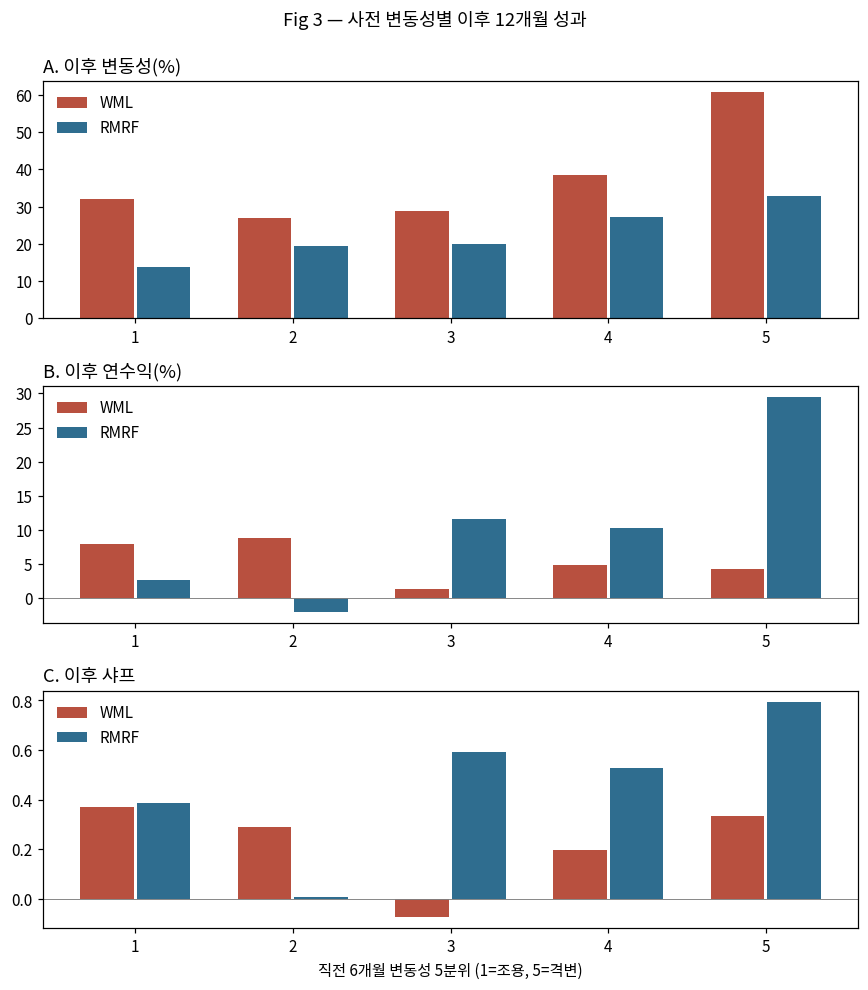
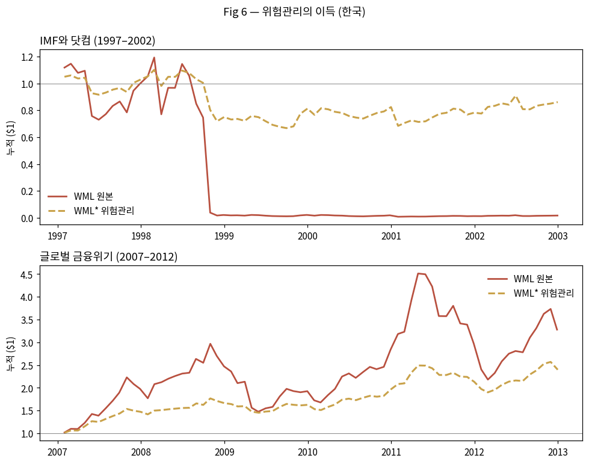

# 무슨 실험을 했고, 뭐가 나왔나 — 아무것도 몰라도 읽히는 정리

> 주식·통계 용어를 하나도 몰라도 따라올 수 있게 썼다. 낯선 말은 나올 때마다 바로 풀이한다.
> 더 깊게 보려면: 노트북 `notebooks/momentum_korea.ipynb` (과정을 한 칸씩 실행하며 볼 수 있음).

---

## 0. 실험을 한 문장으로

> **"최근에 오르던 주식을 사고, 내리던 주식을 파는 전략(=모멘텀)은 평소엔 쏠쏠한데
> 아주 가끔 한 방에 전 재산이 날아간다. 그런데 '요즘 시장이 얼마나 출렁이는지'만 보고
> 투자 금액을 조절하면 그 한 방을 피할 수 있다"** — 2015년 미국 논문의 주장.
> 이게 한국 주식에서도 통하는지, 한국 데이터 35년으로 직접 확인했다.

---

## 1. 재료 — 어떤 데이터를 썼나

- **한국의 모든 상장 주식** (코스피+코스닥)의 **1990~2026년 매일의 가격**과 **회사 크기**
  - *회사 크기(시가총액)* = 주가 × 발행 주식 수. "그 회사를 통째로 사려면 얼마"라는 뜻.
- **망해서 사라진 회사도 전부 포함**시켰다. 살아남은 회사만 보면 성적이 부풀려지기 때문
  (반에서 자퇴한 학생을 빼고 평균 내면 평균이 올라가는 것과 같은 착시).
- 남이 계산해 둔 지표는 하나도 안 썼다. **원재료(가격표)에서 전부 직접 계산**했다.

---

## 2. 과정 — 요리 레시피처럼 6단계

**① 매달 말, 모든 주식의 "지난 1년 성적표"를 만든다.**
단, 바로 지난 한 달은 성적에서 뺀다 — 막판에 급등한 주식은 곧 되돌아오는 버릇이 있어서,
넣으면 오히려 방해가 된다.

**② 성적순으로 10개 반으로 나눈다.** 1등 반 = "승자들", 꼴찌 반 = "패자들".

**③ 반 안에서는 큰 회사에 돈을 더 태운다.**
동네 작은 회사는 가격이 널뛰어서, 회사 크기에 비례해 담아야 잡음이 줄어든다.

**④ 승자 반은 사고, 패자 반은 "빌려서 판다".**
*빌려서 판다(공매도)* = 주식을 빌려 지금 팔고, 나중에 싸지면 되사서 갚는 것 — 즉 **내리면 돈을 버는** 방법.
"승자가 번 것 − 패자가 번 것"의 차이가 이 전략(모멘텀)의 한 달 성적. 이걸 매달 반복한다.

**⑤ 매일 이 전략의 성적이 얼마나 출렁이는지 잰다.**
매일 성적의 오르내림 폭을 모으면 "요즘 위험이 큰지 작은지"가 숫자로 나온다.

**⑥ 요즘 출렁임이 크면 투자 금액을 자동으로 줄이고, 조용하면 늘린다.**
이게 논문의 핵심 아이디어 — **"위험관리 버전"**이다.
중요한 규칙: **어제까지의 정보만 쓴다.** 미래를 훔쳐보고 정하는 반칙(사후 확신 편향)이 없다.

---

## 3. 결과물 — 그림 4장 + 표 2개, 각각 무슨 뜻인가

### 표 1 — 성적 비교표: "한국에서 모멘텀은 미국만큼 세지 않다"

| | 위험 대비 성적* | 최악의 한 달 |
|---|---|---|
| 시장 전체를 그냥 사기 | **0.41** | −26% |
| 모멘텀 전략 | 0.17 | **−94.9%** |

\* *위험 대비 성적(샤프비율)* = 번 돈을 마음고생(출렁임)으로 나눈 값. **클수록 "편하게 잘 벌었다"**는 뜻.

**읽는 법**: 미국에선 모멘텀이 모든 전략 중 1등(0.53)인데, 한국에선 시장을 그냥 사는 것의
절반도 안 된다(0.17). **그런데** 최악의 한 달에 −94.9% — "거의 전 재산이 날아가는 한 방"은
한국에도 분명히 존재한다. → 그래서 위험관리가 더더욱 필요하다.

### 그림 1 — 그 "한 방"의 현장: 1998년



**읽는 법**: 파란 선 = 시장 전체, 빨간 점선 = 모멘텀. 1998년 말, IMF 충격에서 시장이
살아나기 시작하는 바로 그때 — 모멘텀에 넣어둔 **1,000원이 20원이 된다**.
이유: 폭락 때 바닥까지 떨어졌던 주식들(=우리가 "빌려서 판" 패자들)이 반등장에서
한 달에 2배씩 튀어 오르면서, 내리면 벌기로 한 쪽이 몰살당한 것.
**교훈: 모멘텀의 참사는 "시장이 무너질 때"가 아니라 "무너졌다가 살아날 때" 온다.**

### 그림 2 — 출렁임은 조용할 때와 미칠 때가 따로 있다



**읽는 법**: 이 전략의 "요즘 출렁임"을 매달 재서 이은 선. 낮을 땐 연 7%, 1998~2000년
같은 때는 **95%**까지 치솟는다. 출렁임은 일정하지 않다 — 그리고 산처럼 뭉쳐서 온다.

### 그림 3 — 출렁였던 다음엔, 벌이도 나빠진다 (이게 핵심 근거)



**읽는 법**: 매달을 "직전 6개월이 얼마나 출렁였나"로 조용한 달(1)부터 격했던 달(5)까지
5칸으로 나누고, 그 **다음 1년** 성적을 봤다.
- 맨 위(A): 어제 출렁였으면 내일도 출렁인다 → **출렁임은 예측이 된다**
- 가운데(B)와 아래(C): 시장(파랑)은 출렁인 다음에 오히려 더 벌어주는데,
  **모멘텀(빨강)은 출렁인 다음에 벌이가 사라진다**
- → 결론: "출렁일 땐 모멘텀에서 돈을 빼라"가 데이터로 정당화된다.

### 표 3 — 위험관리를 하면 이렇게 바뀐다

| | 위험 대비 성적 | 최악의 한 달 | 극단적 사건 빈도* |
|---|---|---|---|
| 모멘텀 그대로 | 0.16 | −94.9% | 10.7 |
| **위험관리 버전** | **0.25** | **−20.1%** | **2.5** |

\* *극단적 사건 빈도(첨도)* = "설마 하는 일"이 얼마나 자주 터지나. 0에 가까울수록 얌전한 분포.

**읽는 법**: 위험 대비 성적은 1.5배가 되고, 전 재산 날리는 달(−94.9%)이 −20.1%로 순해지고,
"설마"의 빈도가 1/4로 준다. **번 돈이 늘어서가 아니라, 죽는 달을 피해서 얻는 개선**이다.

### 그림 6 — 같은 1998년, 위험관리를 했더라면



**읽는 법**: 빨간 선 = 원래 모멘텀(1,000원→**20원**), 노란 점선 = 위험관리 버전(1,000원→**860원**).
위험관리 버전은 폭풍이 오기 전에(출렁임이 커지는 걸 보고) 이미 투자 금액을 줄여놨기 때문에
같은 참사를 거의 비껴갔다. 미래를 본 게 아니라, **어제까지의 출렁임만 보고** 그렇게 했다.

---

## 4. 그래서 결론은

1. 한국에서 모멘텀 전략 자체는 **미국만큼 대단하지 않다** (시장의 절반 이하).
2. 하지만 **"한 방에 죽는 위험"은 한국에도 실재**한다 (1998년 −94.9%).
3. 그 위험은 **예측이 가능**하고(어제 출렁이면 내일도 출렁인다),
4. 예측된 위험으로 투자 금액만 조절해도 **참사를 피하고 성적이 좋아진다** (0.16→0.25).
5. → 논문의 핵심 주장이 **미국이 아닌 시장, 심지어 모멘텀이 약한 시장에서도 재현**된다.

## 5. 이 결과를 믿어도 되는 이유

- 같은 계산을 **서로 다른 두 방식으로 두 번** 구현했고(쉬운 버전 + 정밀 버전),
  마지막에 **6개 핵심 숫자가 서로 일치하는지 자동으로 검사**한다. 전부 통과했다.
- 미래 정보를 쓰는 반칙이 없는지, 사라진 회사가 빠지지 않았는지 각각 확인했다.
- 그림은 전부 실제 계산 결과에서 나온 것이며, 눈으로 하나하나 검수했다.

## 6. 직접 다시 돌려보기

```bash
jupyter nbconvert --to notebook --execute --inplace notebooks/momentum_korea.ipynb
```
5분쯤 걸린다. 마지막 칸에 **"✅ 전체 PASS"**가 뜨면 위 결과가 그대로 재현된 것이다.

---
*용어 미니 사전* — **모멘텀**: 오르던 게 계속 오르는 경향, 또는 그걸 이용하는 전략 ·
**공매도**: 빌려서 팔고 내리면 되사서 갚기 (하락에 베팅) · **시가총액**: 회사 통째 가격 ·
**샤프비율**: 번 돈 ÷ 마음고생, 클수록 좋음 · **첨도**: "설마"가 터지는 빈도 ·
**위험관리 버전(WML\*)**: 출렁임이 크면 자동으로 투자 금액을 줄이는 모멘텀.
